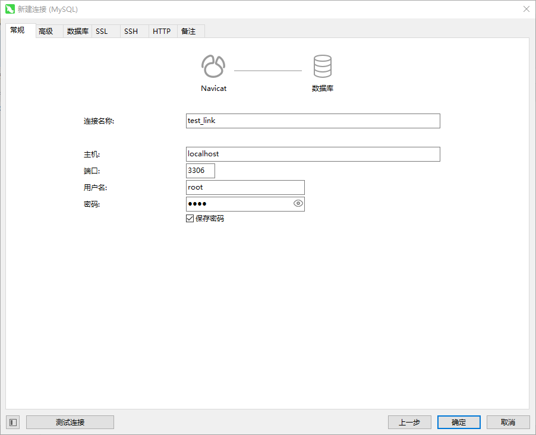

# MySQL 教程

## 本机开发环境快速搭建

> 没有必要去 [MySQL 中文官网](https://www.mysql.com/cn/)下载安装程序然后再进行安装，如果感兴趣，可以自行去[下载中心](https://dev.mysql.com/downloads/mysql/)查看。

本着快速搭建服务器（本机也可以视作服务器）环境的宗旨，我们可以采用更简单的方式，如使用[小皮面板](https://www.xp.cn/php-study)，正如其 slogan，**让天下没有难配的服务器环境**，我们可以通过 phpStudy 快速下载并安装 MySQL 数据库，当然还有其他服务器环境中所需要的软件，如 Apache、Nginx、FTP、php、redis 等。

### 下载


### 安装

> 1. 安装路径不能包含“中文”或者“空格”，否则会报错；
>
> 2. 保证安装路径是纯净的，安装路径下不能有已安装的版本；


### 使用


默认已存在 MySQL5.7.26 版本，如果需要其他版本，可以在 **软件管理** 界面进行下载安装，如下载安装 MySQL8.0.12。


如此即可在 **数据库** 界面管理 MySQL，但一般情况下不需要操作，保持默认即可。


在 **首页** 即可启动 MySQL。


## 数据库工具选择

我们可以选择 [JetBrains](https://www.jetbrains.com/zh-cn/) 家族的 [DataGrip](https://www.jetbrains.com/zh-cn/datagrip/) 软件，感谢 [zhile](https://zhile.io/) 大佬和[热心大佬](https://3.jetbra.in/)。

也可以选择 [Navicat](https://www.navicat.com.cn/) 家族的 [Navicat Premium Lite](https://www.navicat.com.cn/download/navicat-premium-lite)，感谢 Navicat 推出免费精简版，精简版已经够我们学习使用，如果需要 [Navicat Premium](https://www.navicat.com.cn/products/navicat-premium)，请自行寻找[破解方法](https://learnku.com/articles/67706)。

### 使用

常规安装，不过需要创建一个 Navicat ID。





如此即可操作 MySQL 数据库，无论是可视化编程，还是代码编程，都可以。

## DDL + DML

无论是 **数据定义语言** 还是 **数据操纵语言** 都可以使用可视化编程，此处不涉及。MySQL 基础完全可以自学，感谢[菜鸟教程](https://www.runoob.com/mysql/mysql-tutorial.html)。

### DDL

#### 查看所有数据库

```mysql
show databases;
```

#### 切换到指定数据库

```mysql
use <database-name>
```

#### 查看所有数据表

```mysql
show tables;
```

#### 创建数据库

```mysql
create database [if not exists] <database-name>
```

#### 删除数据库

```mysql
drop database [if exists] <database-name>;
```

#### 创建数据表

```mysql
create table [if not exists] <table-name> (
	<column-name> <datatype> <option>,
    ...
)
```

```mysql
CREATE TABLE users (
    id INT AUTO_INCREMENT PRIMARY KEY, # 主键定义方式一，适用于单个字段作为主键
    username VARCHAR(50) NOT NULL,
    email VARCHAR(100) NOT NULL,
    birthdate DATE,
    is_active BOOLEAN DEFAULT TRUE
);
```

```mysql
CREATE TABLE users (
    id INT AUTO_INCREMENT,
    username VARCHAR(50) NOT NULL,
    email VARCHAR(100) NOT NULL,
    birthdate DATE,
    is_active BOOLEAN DEFAULT TRUE,
    PRIMARY KEY (id) # 主键定义方式二，适用于多个字段的组合作为主键
);
```

#### 删除数据表

```mysql
drop table [if exists] <table-name>;
```

#### 修改数据表

##### 修改表名

```mysql
ALTER TABLE <old-table-name>
RENAME TO <new-table-name>;
```

##### 添加列

```mysql
ALTER TABLE <table-name>
ADD COLUMN <new-column-name> <datatype>;
```

##### 修改列名

```mysql
ALTER TABLE <table-name>
CHANGE COLUMN <old-column-name> <new-column-name> <datatype>;
```

##### 修改列数据类型

```mysql
ALTER TABLE <table-name>
MODIFY COLUMN <column-name> <new-datatype>;
```

##### 删除列

```mysql
ALTER TABLE <table-name>
DROP COLUMN <column-name>;
```

### DML

#### 插入数据

```mysql
insert into <table-name> (<column-name>, ...) values (<value>, ...);
```

```mysql
INSERT INTO users (username, email, birthdate, is_active)
VALUES ('test', 'test@gmail.com', '1990-01-01', true);
```

```mysql
INSERT INTO users
VALUES (NULL,'test', 'test@gmail.com', '1990-01-01', true); # `NULL` 是用于自增长列的占位符
```

```mysql
# 注意：和 SQL Server 中插入多行数据不通，MySQL 可以在 `VALUES` 子句中指定多组数值，而 SQL Server 则需要执行多次 INSERT 语句
INSERT INTO users (username, email, birthdate, is_active)
VALUES
    ('test1', 'test1@gmail.com', '1985-07-10', true),
    ('test2', 'test2@gmail.com', '1988-11-25', false),
    ('test3', 'test3@gmail.com', '1993-05-03', true);
```

#### 查询数据

```mysql
SELECT <column-name>, ... # 使用 * 表示选择所有列
FROM <table-name>
[WHERE <condition>] # 可以使用各种条件运算符（如 =, <, >, <=, >=, !=, LIKE），逻辑运算符（如 AND, OR, NOT, IN, BETWEEN ... AND ..., IS NULL, IS NOT NULL），以及通配符（如 _, %）等
[ORDER BY <column-name> [ASC | DESC], ...] # 默认是升序（ASC）
[LIMIT <number>]; # 用于限制返回的行数
```

#### 更新数据

```mysql
UPDATE <table-name>
SET <column-name> = <value>, ...
WHERE <condition>;
```

`customers`

| customer_id | name    | customer_type | total_purchases |
| ----------- | ------- | ------------- | --------------- |
| 1           | Alice   | Premium       | 0               |
| 2           | Bob     | Regular       | 0               |
| 3           | Charlie | Premium       | 0               |

`orders`

| order_id | customer_id | amount |
| -------- | ----------- | ------ |
| 1        | 1           | 50     |
| 2        | 1           | 75     |
| 3        | 2           | 100    |
| 4        | 3           | 200    |
| 5        | 3           | 150    |

```mysql
UPDATE customers
SET total_purchases = (
    SELECT SUM(amount)
    FROM orders
    WHERE orders.customer_id = customers.customer_id
)
WHERE customer_type = 'Premium';
```

`customers`

| customer_id | name    | customer_type | total_purchases |
| ----------- | ------- | ------------- | --------------- |
| 1           | Alice   | Premium       | 125             |
| 2           | Bob     | Regular       | 0               |
| 3           | Charlie | Premium       | 350             |

#### 删除数据

```mysql
DELETE FROM <table-name>
WHERE <condition>;
```

#### 分组

```mysql
SELECT <column-name>, aggregate_function(<other-column-name>) # column-name 要么是分组的字段，要么放在聚合函数（如 AVG, COUNT, MAX, MIN, SUM）中
FROM <table-name>
WHERE <condition>
GROUP BY <column-name>, ...;
```

