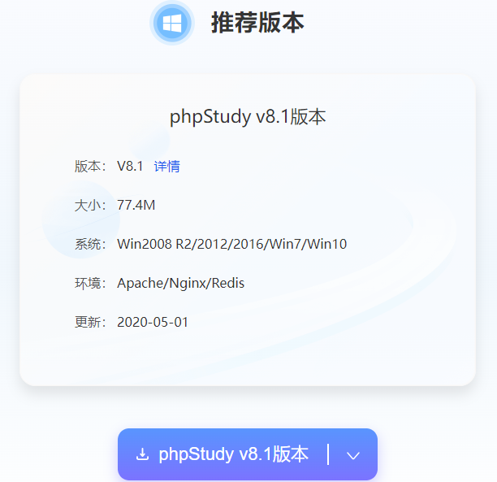
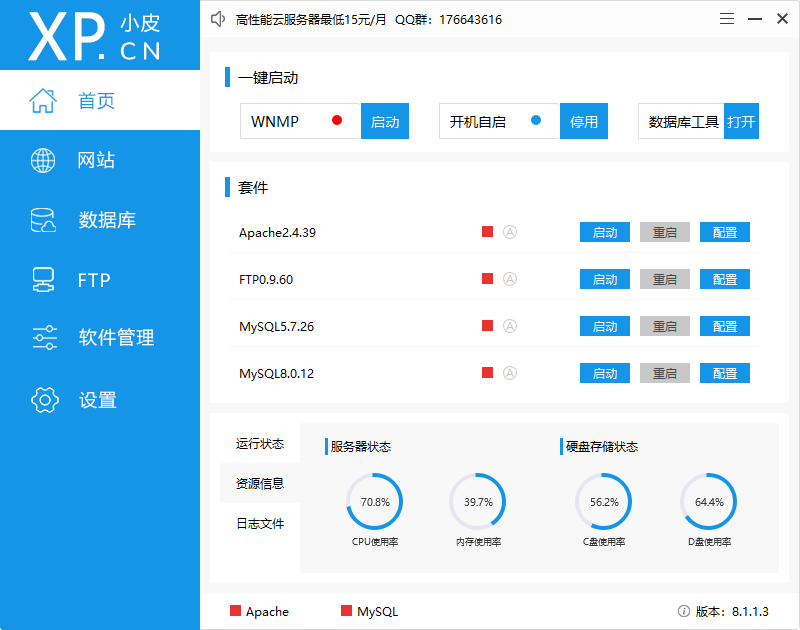
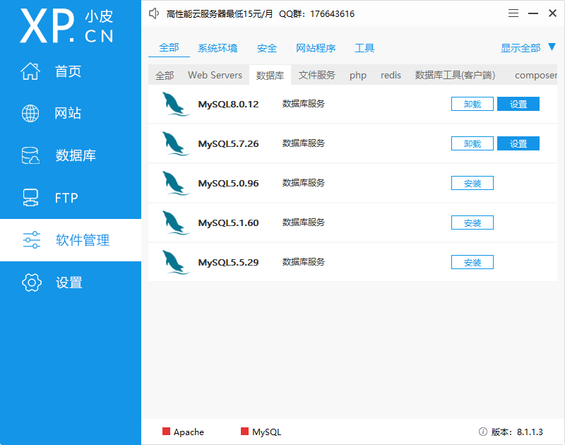
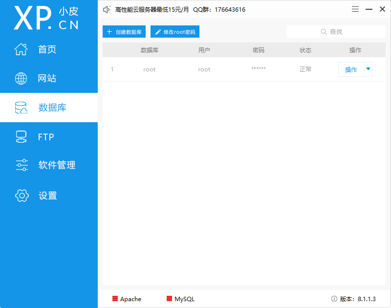
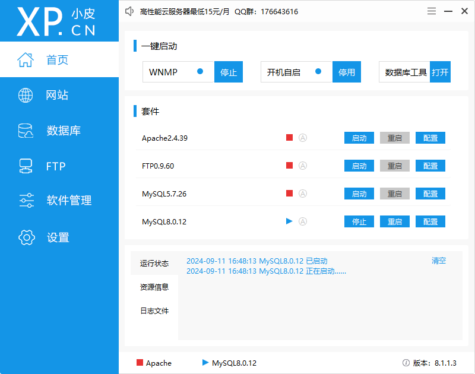
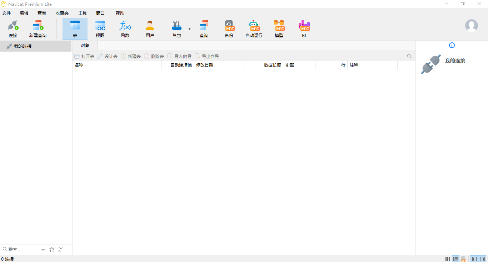
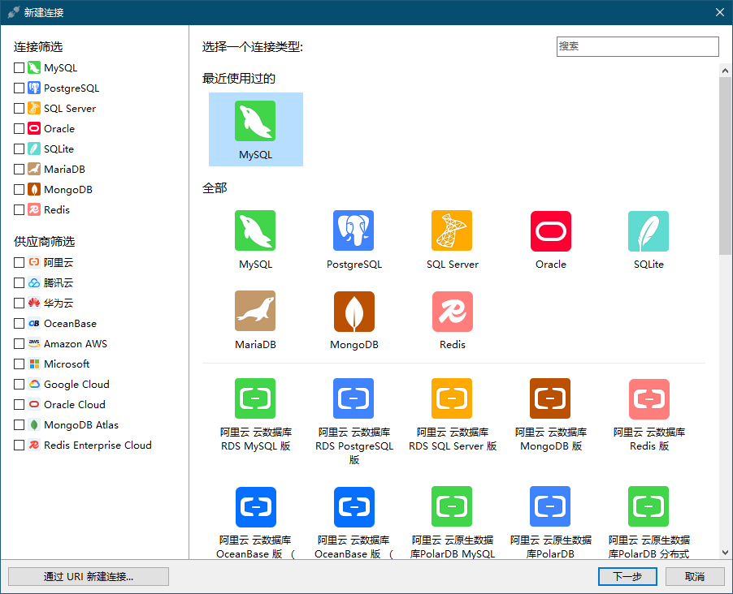
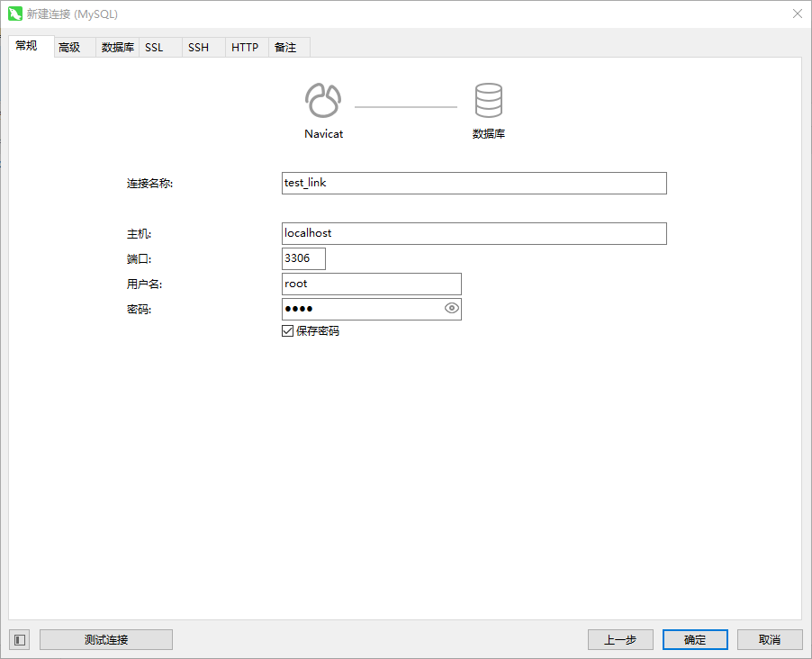
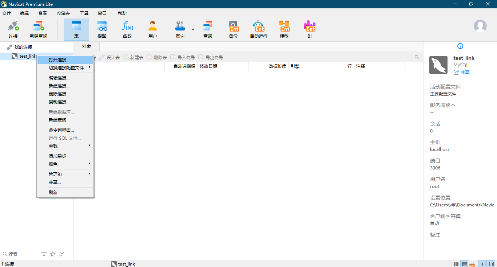
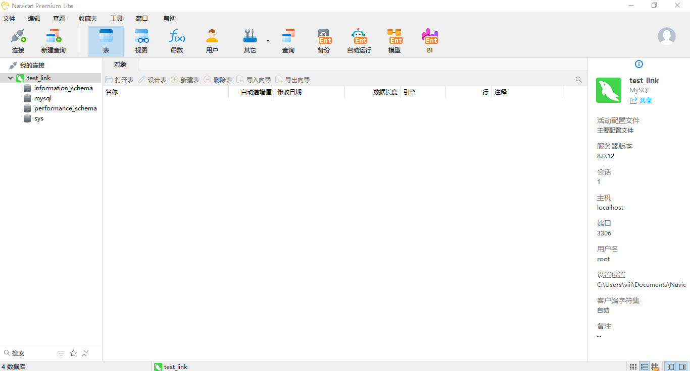

# MySQL 教程

## 本机开发环境快速搭建

> 没有必要去 [MySQL 中文官网](https://www.mysql.com/cn/)下载安装程序然后再进行安装，如果感兴趣，可以自行去[下载中心](https://dev.mysql.com/downloads/mysql/)查看。

本着快速搭建服务器（本机也可以视作服务器）环境的宗旨，我们可以采用更简单的方式，如使用[小皮面板](https://www.xp.cn/php-study)，正如其 slogan，**让天下没有难配的服务器环境**，我们可以通过 phpStudy 快速下载并安装 MySQL 数据库，当然还有其他服务器环境中所需要的软件，如 Apache、Nginx、FTP、php、redis 等。

### 下载

### 安装

> 1. 安装路径不能包含“中文”或者“空格”，否则会报错；
>
> 2. 保证安装路径是纯净的，安装路径下不能有已安装的版本；

### 使用

默认已存在 MySQL5.7.26 版本，如果需要其他版本，可以在 **软件管理** 界面进行下载安装，如下载安装 MySQL8.0.12。

如此即可在 **数据库** 界面管理 MySQL，但一般情况下不需要操作，保持默认即可。

在 **首页** 即可启动 MySQL。

## 数据库工具选择

我们可以选择 [JetBrains](https://www.jetbrains.com/zh-cn/) 家族的 [DataGrip](https://www.jetbrains.com/zh-cn/datagrip/) 软件，感谢 [zhile](https://zhile.io/) 大佬和[热心大佬](https://3.jetbra.in/)。

也可以选择 [Navicat](https://www.navicat.com.cn/) 家族的 [Navicat Premium Lite](https://www.navicat.com.cn/download/navicat-premium-lite)，感谢 Navicat 推出免费精简版，精简版已经够我们学习使用，如果需要 [Navicat Premium](https://www.navicat.com.cn/products/navicat-premium)，请自行寻找[破解方法](https://learnku.com/articles/67706)。

### 使用

常规安装，不过需要创建一个 Navicat ID。

如此即可操作 MySQL 数据库，无论是可视化编程，还是代码编程，都可以。